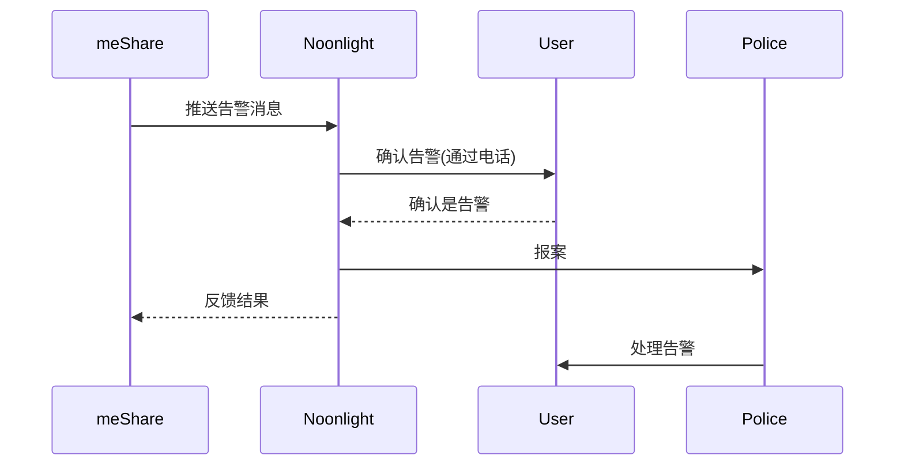

Noonlight 接入调研

### 接入类型

* Dispatch API

方法：推送纯文本告警信息到Noonlight并等待接收Noonlight的反馈结果

   以下是官方流程图：

* Video Monitoring

Dispatch API的升级版，在Dispatch API的基础上增加告警视频，Noonlight会判断告警视频
    

### 价格

### 信息收集

#### 用户信息

1. 真实姓名
2. 手机号码
3. 详细住址

#### 开发者账号

需要一个美国手机号码来注册开发者账号